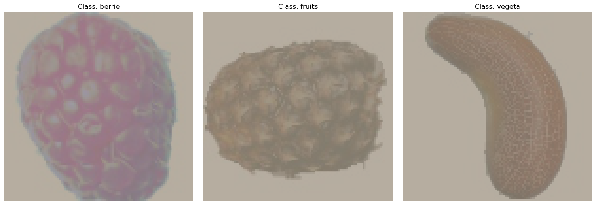

# Fruit, Vegetable and Berry Classifier (CNN)

An early coursework project (2nd year): a small convolutional neural network written from scratch in PyTorch that classifies images into three classes: **berries**, **fruits** and **vegetables**.



## Model

```
Input 3×100×100
  └─ Conv 3→32 (3×3) → ReLU → MaxPool 2×2
  └─ Conv 32→64 (3×3) → ReLU → MaxPool 2×2
  └─ FC 64·25·25 → 512 → ReLU → FC 512 → 3
```

| Setting | Value |
|---|---|
| Loss | Cross-entropy |
| Optimizer | Adam, lr = 0.01 |
| Batch size | 64 |
| Epochs | 10 |

## What the notebook covers

- Loading a class-per-folder dataset with `ImageFolder`, plus a custom `Dataset` for an unlabelled test folder
- Training loop, loss curve and confusion matrix
- Predictions for the unlabelled test images
- **Activation maximisation**: generating an input image that maximises each class's output, to inspect what the network responds to

## Limitations

- The test set has no labels, so accuracy and the confusion matrix are computed on the **training set** only and do not reflect generalisation.
- There is no validation split and no data augmentation.

## Quick start

```bash
pip install -r requirements.txt
jupyter notebook fruit_classifier.ipynb
```

Download the dataset (`frukta.zip`, 22,495 images) from the [release of neural-networks-deep-learning-labs](https://github.com/MP4-Player/neural-networks-deep-learning-labs/releases/tag/v1.0), unpack it and set `PATH` in the notebook to the dataset folder. Layout:

```
<dataset>/
  train/berrie/  train/fruits/  train/vegeta/
  test/*.jpg
```

## Later versions

[`drafts/`](drafts) contains later iterations of the same classifier: `ai1.ipynb` (2025) and the script version `ai-7-f.py`. The same dataset was reused in 2026 for the CNN and transfer-learning labs in [neural-networks-deep-learning-labs](https://github.com/MP4-Player/neural-networks-deep-learning-labs).

## Tech stack

Python · PyTorch · torchvision · scikit-learn · pandas · matplotlib · seaborn

## License

[MIT](LICENSE)
